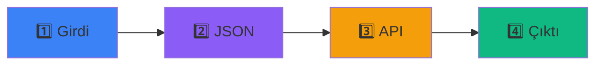

# 🎨 Özellikler / Features

## 🇹🇷 Türkçe

### Ana Özellikler

#### 1. 🔍 Gerçek Zamanlı Görselleştirme

Json-Naked, AI isteklerinin tüm yaşam döngüsünü canlı olarak görselleştirir.

```
Kullanıcı → [Girdi] → [JSON] → [API] → [Yanıt] → [Çıktı]
   ↓          ✓        ✓       ✓        ✓        ✓
Görsel     Mavi     Mor      Turuncu   Kırmızı  Yeşil
Durum    Timeline Timeline Timeline Timeline Timeline
```

**Avantajları:**
- 📊 Her adımı anlık görebilme
- 🎯 Veri dönüşümlerini izleme
- 🔬 Debugging ve analiz kolaylığı
- 📚 Öğrenme sürecini hızlandırma

---

#### 2. 💬 İnteraktif Sohbet Arayüzü

Modern, kullanıcı dostu chat interface.

**Özellikler:**
- ✨ Smooth animasyonlar
- 🎨 Renkli mesaj baloncukları (kullanıcı: mavi, AI: gri)
- ⚡ Hızlı yanıt göstergeleri (3 nokta animasyonu)
- ⌨️ Klavye kısayolları (Enter, Shift+Enter)
- 📱 Mobil uyumlu tasarım
- 🔄 Auto-scroll mesajlara

**Kullanım:**
```
1. Soru yazın → Enter tuşu
2. AI işliyor → Loading animasyonu
3. Yanıt geldi → Smooth scroll
4. Devam edin → Sohbet akışı
```

---

#### 3. 📦 JSON Payload Görüntüleyici

Tüm JSON yapılarını detaylı görüntüleme.

**Ne Gösterir?**

**Request Payload:**
```json
{
  "model": "gemini-3-pro-preview",
  "contents": [
    {
      "role": "user",
      "parts": [{"text": "..."}]
    }
  ],
  "config": {
    "temperature": 0.7,
    "topK": 40,
    "topP": 0.95,
    "maxOutputTokens": 2048
  }
}
```

**Response Payload:**
```json
{
  "candidates": [...],
  "usageMetadata": {
    "promptTokenCount": 10,
    "candidatesTokenCount": 150
  },
  "safetyRatings": [...]
}
```

**Özellikler:**
- 🎨 Syntax highlighting (renklendirme)
- 📋 Kopyalama desteği
- 🔍 Detaylı JSON tree view
- 📊 Token sayaçları
- ⚡ Collapse/expand bölümler

---

#### 4. 🎯 4-Aşamalı İş Akışı

Her AI isteği 4 belirgin aşamada gösterilir.



**Aşama Detayları:**

| Aşama | Açıklama | Gösterge | Süre |
|-------|----------|----------|------|
| 1️⃣ **Girdi** | Kullanıcı metni | 🟦 Mavi | Anında |
| 2️⃣ **JSON** | Serileştirme | 🟪 Mor | ~600ms |
| 3️⃣ **API** | Yanıt alma | 🟧 Turuncu | 1-3s |
| 4️⃣ **Çıktı** | Parse etme | 🟩 Yeşil | ~800ms |

---

#### 5. 📱 Responsive Tasarım

Tüm cihazlarda mükemmel çalışır.

**Desktop (>1024px):**
```
┌─────────────────────────────────────────┐
│  Chat (33%)  │  Visualization (67%)     │
│              │                           │
│   Mesajlar   │  [1] [2] [3] [4]         │
│              │   JSON Viewers           │
│   Input      │                           │
└─────────────────────────────────────────┘
```

**Tablet (768px-1024px):**
```
┌─────────────────────┐
│  Chat (40%)         │
├─────────────────────┤
│  Visualization      │
│  (60%)              │
└─────────────────────┘
```

**Mobile (<768px):**
```
┌─────────────┐
│   Chat      │
│  (50vh)     │
├─────────────┤
│ Visualiz.   │
│  (50vh)     │
└─────────────┘
```

---

#### 6. 🎨 Modern UI/UX

Karanlık tema odaklı, göz yormayan tasarım.

**Renk Paleti:**
- **Primary**: `#3b82f6` (Blue)
- **Secondary**: `#8b5cf6` (Purple)
- **Success**: `#10b981` (Green)
- **Warning**: `#f59e0b` (Orange)
- **Error**: `#ef4444` (Red)
- **Background**: `#111827` (Dark Gray)
- **Surface**: `#1f2937` (Lighter Gray)

**Tipografi:**
- **Font**: System UI Stack (native fonts)
- **Monospace**: `font-mono` (kod için)
- **Sizes**: 
  - `text-xs` → 0.75rem
  - `text-sm` → 0.875rem
  - `text-base` → 1rem
  - `text-lg` → 1.125rem

---

#### 7. ⚡ Performans Optimizasyonları

Hızlı ve verimli çalışma.

**Optimizasyonlar:**
- 🚀 Vite build system (hızlı HMR)
- 📦 Code splitting (lazy loading)
- 🌳 Tree shaking (unused code elimination)
- 💾 Minimal bundle size (~150KB)
- ⚛️ React 19 concurrent features
- 🔄 Efficient re-renders (memoization)

**Metrics:**
```
Build Time: ~2s
Bundle Size: ~150KB (gzipped)
Initial Load: <1s
Time to Interactive: <2s
Lighthouse Score: 95+
```

---

#### 8. 🔒 Güvenlik

Kullanıcı verilerinin güvenliği ön planda.

**Güvenlik Önlemleri:**
- 🔐 API key environment variable'da
- 🚫 No backend, no data storage
- 🔒 HTTPS only (production)
- 🛡️ XSS protection (React DOM)
- ✅ TypeScript type safety
- 🔍 No third-party analytics

**API Key Güvenliği:**
```bash
# ✅ Doğru: .env.local
GEMINI_API_KEY=AIzaSy...

# ❌ Yanlış: Kod içinde
const apiKey = "AIzaSy..." // ASLA YAPMAYIN!
```

---

#### 9. 📊 Eğitsel Değer

Öğrenme odaklı tasarım.

**Öğrenme Hedefleri:**
- 🎓 API çalışma prensipleri
- 🔬 JSON veri formatı
- 🤖 AI model davranışları
- 📡 HTTP request/response
- 🔄 Veri dönüşümleri
- ⚙️ Configuration parametreleri

**Eğitim Senaryoları:**
1. **API 101**: Temel API kavramları
2. **JSON Mastery**: JSON yapısını anlama
3. **AI Demystified**: AI'ın perde arkası
4. **Debug Like Pro**: API debugging teknikleri

---

#### 10. 🌐 Açık Kaynak

Tamamen açık ve özgür.

**Lisans:** MIT License
- ✅ Ticari kullanım
- ✅ Değiştirme
- ✅ Dağıtım
- ✅ Özel kullanım

**Community:**
- 🤝 Katkılar kabul edilir
- 📝 Issues welcome
- 💡 Feature requests
- 🐛 Bug reports

---

### Teknik Özellikler

#### Frontend Stack

```typescript
{
  "framework": "React 19.2",
  "language": "TypeScript 5.8",
  "buildTool": "Vite 6.2",
  "styling": "Tailwind CSS",
  "icons": "Lucide React 0.556",
  "aiSDK": "@google/genai 1.31"
}
```

#### Architecture

```
┌───────────────────────────────┐
│      Presentation Layer        │
│  (App.tsx, Components)        │
├───────────────────────────────┤
│     Business Logic Layer       │
│  (services/gemini.ts)         │
├───────────────────────────────┤
│        Data Layer             │
│  (types.ts, State)            │
└───────────────────────────────┘
```

---

### Karşılaştırma

#### Json-Naked vs. Diğer Araçlar

| Özellik | Json-Naked | Postman | Thunder Client |
|---------|------------|---------|----------------|
| 🎯 Görselleştirme | ✅ 4-aşama | ❌ Yok | ❌ Yok |
| 💬 Chat Interface | ✅ Evet | ❌ Hayır | ❌ Hayır |
| 📚 Eğitsel | ✅ Evet | ⚠️ Kısmen | ⚠️ Kısmen |
| 🆓 Ücretsiz | ✅ Tamamen | ⚠️ Limited | ✅ Evet |
| 🌐 Web-based | ✅ Evet | ⚠️ Desktop | ⚠️ VSCode |
| 🎨 Modern UI | ✅ Evet | ✅ Evet | ⚠️ Basit |

---

## 🇬🇧 English

### Core Features

[Similar structure as Turkish version above...]

---

### Gelecek Özellikler / Future Features

#### v1.1 (Yakında / Coming Soon)
- [ ] 🌓 Dark/Light theme toggle
- [ ] 💾 Chat history persistence
- [ ] 📤 Export conversations (JSON, Markdown)
- [ ] 🔍 Advanced JSON search/filter
- [ ] 📊 Token usage dashboard

#### v1.2
- [ ] 🌊 Streaming responses
- [ ] 🎨 Custom color themes
- [ ] 🔄 History management (delete, favorite)
- [ ] 📱 Progressive Web App (PWA)
- [ ] 🌐 Full i18n support

#### v2.0
- [ ] 🤖 Multiple AI models (GPT-4, Claude, etc.)
- [ ] 🔐 User authentication
- [ ] ☁️ Cloud sync
- [ ] 📊 Advanced analytics
- [ ] 🎓 Interactive tutorial mode

---

<div align="center">
  <p>✨ Daha fazlası yolda! / More coming soon!</p>
  <p><a href="https://github.com/ksbicorp/Json-Naked/issues">Özellik iste / Request feature</a></p>
</div>
