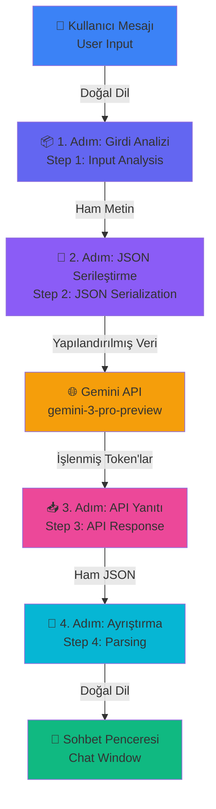

<div align="center">
  <h1>🔍 Json-Naked</h1>
  <h3>Gemini Algoritma Keşfedici / Gemini Algorithm Explorer</h3>
  <p><em>Yapay Zeka İsteklerinin Yaşam Döngüsünü Görselleştiren Eğitici Platform</em></p>
  <p><em>Educational Platform Visualizing the AI Request Lifecycle</em></p>
  
  
  
  
  
  
</div>

---

## 📋 İçindekiler / Table of Contents

- [🎯 Amaç / Purpose](#-amaç--purpose)
- [✨ Yenilikler / Innovations](#-yenilikler--innovations)
- [🎬 Nasıl Çalışır? / How It Works](#-nasıl-çalışır--how-it-works)
- [🚀 Kurulum / Installation](#-kurulum--installation)
- [💡 Kullanım / Usage](#-kullanım--usage)
- [🏗️ Teknik Mimari / Technical Architecture](#️-teknik-mimari--technical-architecture)
- [📸 Ekran Görüntüleri / Screenshots](#-ekran-görüntüleri--screenshots)
- [🤝 Katkıda Bulunma / Contributing](#-katkıda-bulunma--contributing)

---

## 🎯 Amaç / Purpose

### 🇹🇷 Türkçe

**Json-Naked** (Gemini Algoritma Keşfedici), yapay zeka sistemlerinin "perde arkasını" görünür kılan, eğitici bir web uygulamasıdır. 

**Temel Amaçlar:**
- 🔬 **Şeffaflık**: Doğal dilin JSON'a nasıl dönüştürüldüğünü gösterir
- 📚 **Eğitim**: AI API'lerinin çalışma prensiplerini öğretir
- 🎓 **Farkındalık**: Kullanıcılara AI sistemlerinin iç yapısını anlatır
- 🔍 **Görselleştirme**: Karmaşık veri akışlarını anlaşılır hale getirir

Bu uygulama, özellikle geliştiriciler, öğrenciler ve AI meraklıları için, Gemini AI'ın nasıl çalıştığını adım adım gösteren canlı bir eğitim aracıdır.

### 🇬🇧 English

**Json-Naked** (Gemini Algorithm Explorer) is an educational web application that makes the "behind the scenes" of AI systems visible.

**Core Purposes:**
- 🔬 **Transparency**: Shows how natural language is transformed into JSON
- 📚 **Education**: Teaches the working principles of AI APIs
- 🎓 **Awareness**: Explains the internal structure of AI systems to users
- 🔍 **Visualization**: Makes complex data flows understandable

This application is a live educational tool especially for developers, students, and AI enthusiasts, showing step-by-step how Gemini AI works.

---

## ✨ Yenilikler / Innovations

### 🇹🇷 Bu Uygulama Ne Getiriyor?

1. **🎭 Gerçek Zamanlı Görselleştirme**
   - Her AI isteğinin 4 aşaması canlı olarak gösterilir
   - JSON payload'ları anında görülebilir
   - Veri dönüşüm süreçleri şeffaftır

2. **📖 Eğitici Yaklaşım**
   - Sohbet yaparak öğrenme (Learning by chatting)
   - Her adım detaylı açıklamalarla sunulur
   - Teknik jargon Türkçe açıklamalarla desteklenir

3. **🔄 Tam Yaşam Döngüsü İzleme**
   - Kullanıcı girdisinden → JSON serileştirmeye
   - API isteğinden → Yanıt ayrıştırmaya
   - Ham veriden → İnsan diline dönüşüm

4. **🎨 Modern ve Responsive Arayüz**
   - Mobil ve masaüstü uyumlu
   - Karanlık tema tasarım
   - Split-panel görselleştirme

### 🇬🇧 What Does This Application Bring?

1. **🎭 Real-Time Visualization**
   - All 4 stages of each AI request shown live
   - JSON payloads instantly visible
   - Data transformation processes are transparent

2. **📖 Educational Approach**
   - Learning by chatting
   - Each step presented with detailed explanations
   - Technical jargon supported with Turkish explanations

3. **🔄 Complete Lifecycle Tracking**
   - From user input → JSON serialization
   - From API request → Response parsing
   - From raw data → Human language transformation

4. **🎨 Modern and Responsive Interface**
   - Mobile and desktop compatible
   - Dark theme design
   - Split-panel visualization

---

## 🎬 Nasıl Çalışır? / How It Works

### 🇹🇷 İş Akışı Diyagramı



### 🇬🇧 Workflow Diagram

**The 4-Stage Lifecycle:**

1. **📝 Natural Language Input**: User types a question in plain language
2. **🔄 JSON Serialization**: Application wraps input into Gemini API's required JSON structure
3. **⚡ API Processing**: Gemini processes tokens and returns structured response
4. **📤 Parsing & Display**: Application extracts text and displays it naturally

---

## 🚀 Kurulum / Installation

### 🇹🇷 Ön Gereksinimler

- **Node.js** (v18 veya üzeri)
- **npm** veya **yarn**
- **Gemini API Key** ([buradan alın](https://aistudio.google.com/app/apikey))

### Adım Adım Kurulum

```bash
# 1. Repoyu klonlayın
git clone https://github.com/ksbicorp/Json-Naked.git
cd Json-Naked

# 2. Bağımlılıkları yükleyin
npm install

# 3. Çevre değişkenlerini ayarlayın
# .env.local dosyası oluşturun ve API anahtarınızı ekleyin
echo "GEMINI_API_KEY=your_api_key_here" > .env.local

# 4. Uygulamayı başlatın
npm run dev
```

### 🇬🇧 Prerequisites

- **Node.js** (v18 or higher)
- **npm** or **yarn**
- **Gemini API Key** ([get it here](https://aistudio.google.com/app/apikey))

### Step-by-Step Installation

```bash
# 1. Clone the repository
git clone https://github.com/ksbicorp/Json-Naked.git
cd Json-Naked

# 2. Install dependencies
npm install

# 3. Set up environment variables
# Create .env.local file and add your API key
echo "GEMINI_API_KEY=your_api_key_here" > .env.local

# 4. Start the application
npm run dev
```

Uygulama `http://localhost:5173` adresinde çalışacaktır.

---

## 💡 Kullanım / Usage

### 🇹🇷 Temel Kullanım

1. **Uygulama Başlatın**: `npm run dev` komutuyla uygulamayı çalıştırın
2. **API Anahtarını Girin**: İlk açılışta `.env.local` dosyasında API anahtarınızın olduğundan emin olun
3. **Sohbet Başlatın**: Sol paneldeki metin kutusuna bir soru yazın
   - Örnek: "Kuantum fiziğini açıkla"
   - Örnek: "JavaScript'te array metodları nelerdir?"
4. **İşlemi İzleyin**: Sağ panelde 4 aşamalı süreci canlı izleyin
5. **JSON'ları İnceleyin**: Her adımda oluşan JSON yapılarını detaylı görün

### 🇬🇧 Basic Usage

1. **Start Application**: Run the app with `npm run dev`
2. **Enter API Key**: Ensure your API key is in `.env.local` file on first launch
3. **Start Chatting**: Type a question in the text box on the left panel
   - Example: "Explain quantum physics"
   - Example: "What are array methods in JavaScript?"
4. **Watch the Process**: View the 4-stage process live on the right panel
5. **Inspect JSONs**: See detailed JSON structures generated at each step

### 📊 İzlenebilen Veri Katmanları / Trackable Data Layers

| Katman / Layer | Açıklama / Description |
|----------------|------------------------|
| 🟦 **Girdi (Input)** | Ham kullanıcı metni / Raw user text |
| 🟪 **İstek JSON (Request JSON)** | API'ye gönderilen yapılandırılmış veri / Structured data sent to API |
| 🟥 **Yanıt JSON (Response JSON)** | API'den dönen ham yanıt / Raw response from API |
| 🟩 **Çıktı (Output)** | Kullanıcıya sunulan doğal dil / Natural language presented to user |

---

## 🏗️ Teknik Mimari / Technical Architecture

### 🇹🇷 Teknoloji Yığını

```
Frontend Stack:
├── React 19.2          → UI Framework
├── TypeScript 5.8      → Type Safety
├── Vite 6.2            → Build Tool & Dev Server
├── Tailwind CSS        → Styling (via className)
└── Lucide React        → Icon Library

Backend/API:
├── @google/genai       → Gemini SDK
└── gemini-3-pro-preview → AI Model

Development:
├── ESLint              → Code Quality
└── Node.js Types       → Type Definitions
```

### 🇬🇧 Project Structure

```
Json-Naked/
│
├── App.tsx                 # Ana uygulama komponenti / Main app component
├── index.tsx               # React entry point
├── index.html              # HTML template
│
├── components/
│   ├── JsonViewer.tsx      # JSON görselleştirici / JSON visualizer
│   └── WorkflowStep.tsx    # İş akışı adım komponenti / Workflow step component
│
├── services/
│   └── gemini.ts           # Gemini API entegrasyonu / Gemini API integration
│
├── types.ts                # TypeScript tip tanımları / Type definitions
├── package.json            # Proje bağımlılıkları / Project dependencies
├── tsconfig.json           # TypeScript konfigürasyonu
├── vite.config.ts          # Vite konfigürasyonu
└── metadata.json           # Uygulama metadatası / App metadata
```

### 🔄 Veri Akışı / Data Flow

```
User Input → App State → Gemini Service → API Request
                ↑                              ↓
         UI Updates ← State Update ← API Response
```

---

## 📸 Ekran Görüntüleri / Screenshots

### 🖼️ Ana Arayüz / Main Interface

**Sol Panel (Sohbet):**
- Kullanıcı mesajları (mavi baloncuklar)
- AI yanıtları (gri baloncuklar)
- Girdi alanı ve gönder butonu

**Sağ Panel (Görselleştirme):**
- 4 aşamalı iş akışı gösterimi
- JSON payload görüntüleyici
- Canlı durum göstergeleri

### 🎯 Örnek Akış / Example Flow

```
Kullanıcı: "Yapay zeka nedir?"
          ↓
[Adım 1] Girdi analizi → "Yapay zeka nedir?"
          ↓
[Adım 2] JSON oluşturma → { "contents": [...], "role": "user" }
          ↓
[Adım 3] API yanıtı → { "candidates": [...], "safetyRatings": [...] }
          ↓
[Adım 4] Metin çıkarma → "Yapay zeka, makinelerin..."
```

---

## 🤝 Katkıda Bulunma / Contributing

### 🇹🇷 Nasıl Katkıda Bulunulur?

Bu projeye katkıda bulunmaktan mutluluk duyarız! İşte adımlar:

1. **Fork Yapın**: Projeyi kendi hesabınıza fork edin
2. **Branch Oluşturun**: `git checkout -b feature/yeni-ozellik`
3. **Değişiklik Yapın**: Kodunuzu yazın ve test edin
4. **Commit Edin**: `git commit -m 'Yeni özellik: ...'`
5. **Push Edin**: `git push origin feature/yeni-ozellik`
6. **Pull Request Açın**: GitHub üzerinden PR oluşturun

### 🇬🇧 How to Contribute?

We're happy to accept contributions! Here are the steps:

1. **Fork**: Fork the project to your account
2. **Create Branch**: `git checkout -b feature/new-feature`
3. **Make Changes**: Write and test your code
4. **Commit**: `git commit -m 'Add new feature: ...'`
5. **Push**: `git push origin feature/new-feature`
6. **Open Pull Request**: Create a PR on GitHub

### 🐛 Hata Bildirimi / Bug Reports

Bir hata buldunuz mu? [Issues](https://github.com/ksbicorp/Json-Naked/issues) sayfasında bildirin.

---

## 📜 Lisans / License

Bu proje MIT lisansı altında sunulmaktadır. Detaylar için `LICENSE` dosyasına bakın.

---

## 🙏 Teşekkürler / Acknowledgments

- **Google Gemini Team** - Güçlü AI API'si için
- **React Team** - Harika framework için
- **Vite Team** - Hızlı build tool için
- **Tüm Katkıda Bulunanlar** - Destekleri için

---

## 📧 İletişim / Contact

Sorularınız veya önerileriniz için:
- **GitHub Issues**: [Yeni Issue Aç](https://github.com/ksbicorp/Json-Naked/issues/new)
- **Repository**: [Json-Naked](https://github.com/ksbicorp/Json-Naked)

---

<div align="center">
  <p>⭐ Projeyi beğendiyseniz yıldız vermeyi unutmayın! / Don't forget to star if you like the project!</p>
  <p>Made with ❤️ for AI Education</p>
</div>
